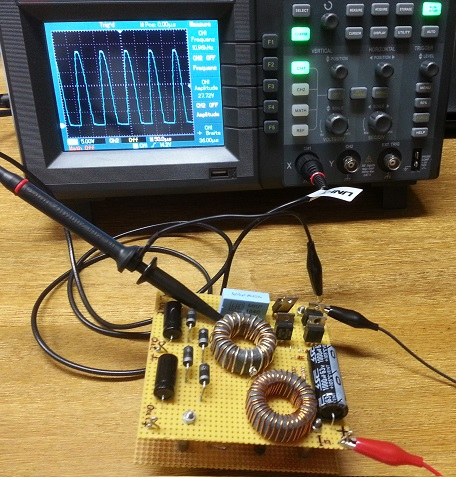
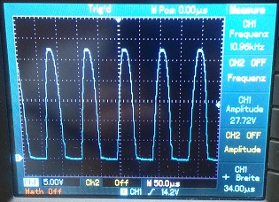

# royer-converter-1
My first self-made Royer oscillator.

Oscillator frequency: about 10 kHz.

Take a look also at my [second royer converter](https://github.com/aelfimow/royer-converter-2).

## Schematics

## Choke

## Transformer
Primary winding:

Primary with secondary winding:

## Top of the board

## Bottom of the board

## Measurement of the oscillator frequency

Result:

